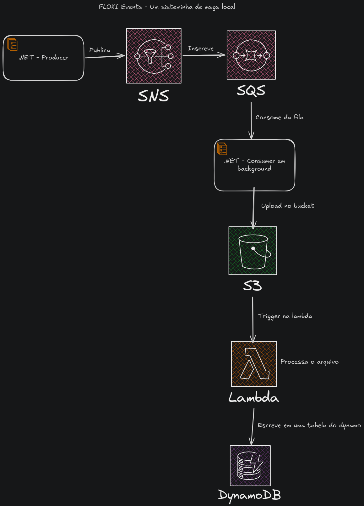

# floki-events

A simple experiment with FLOCI and event driven approach.
We have the following services configured:

1. A producer
2. SNS and SQS
3. A consumer
4. Bucket
5. Lambda
6. Dynamo to save data just because

# Simple project just to test the floci structure, the diagram goes like this:

